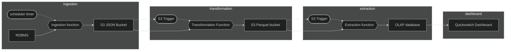

[](https://github.com/samule-i/gneiss-totesys/actions/workflows/test_deploy.yml)
[](https://coveralls.io/github/samule-i/gneiss-totesys)
# gneiss-totesys

Gneiss-totesys generates a Data Warehouse by collecting data from an OLTP database and transforming the data into an easily queriable and analysable state on an OLAP database in accordance with a specification.

This database provides business insights that are otherwise unavailable and can help inform future business decisions by ensuring that the data is useful and as up to date as possible with their current activity.

## Technologies

Python: python was used as it provides a set of tools that allow managing datasets safely and reliably, with a testing suite that prevents errors in the data we handle.

TDD: pytest & coverage is implemented to ensure that this set of applications remains stable and performs to the customers wishes, with an explicit restriction that 90% coverage must be met for code to be accepted.

Terraform: This set of applications are deployed to Amazon Web Services to provide reliability in uptime and provide a rapid support response from the developers if there is an unexpected change in state anywhere in the pipeline.

PostgreSQL: Postgresql is used to collect and store data in a safe and reliable way, paramaterisation is used to prevent oversights or vulnerabilities that would ruin trust in the resulting data.

Github Actions: A CI/CD workflow using github actions ensures that testing is up to date and that the development team is quickly aware of any issues as they happen.

## Methodologies

Developed with an AGILE approach to working, taking rapid iterative steps to ensure that time and resources don't get wasted that keeps the team well informed about problems and solutions that are being used.

Daily stand-ups and pair programming was used extensively to keep team members better informed throughout the project and to encourage collaboration and thoroughness with produced work.

Communication has been key throughout, a team effort has allowed us to explore solutions rapidly whilst providing feedback to the entire team and produced more maintainable and trusted code as a result.

## Setup

### Download the repository

```sh
git clone https://github.com/samule-i/gneiss-totesys
cd gneiss-totesys
```

### download requirements & setup environment

```sh
apt install python3 python-is-python3
make init
```

### Running standards tests and unit tests

```sh
make standards && make unit-tests
```

## Deployment

### Setting your environment

Ensure that you have AWS keys available in `~/.aws/credentials`, available when you create a user at [iam/users](https://us-east-1.console.aws.amazon.com/iam/home?region=eu-north-1#/users)

```sh
[default]
aws_access_key_id = ...
aws_secret_access_key = ...
```

Create the file `./terraform/vars.tfvars`

```tf
db_credentials_olap = "base64 string" // eg. "ZXhhbXBsZSBqYXp6IG11c2ljCg...=="
db_credentials_oltp = "base64 string" // eg. "ZXhhbXBsZSBqYXp6IG11c2ljCg...=="
sns_emails = "base64 string"
lambda_name = "your_ingest_lambda_name"
lambda_json_to_parquet_name = "your_parquet_lambda_name"
lambda_OLAP_loader_name = "your_olap_lambda_name"
```

### email base64 generation

emails should be seperated by `', '` here, it is important because terraform parses emails as a comma seperated list.

```sh
EMAILS="email1@domain.com, email2@domain.com, email3@domain.com,"
echo $EMAILS | base64
```

### credentials base64 generation

Create a json file for both your input & your output database

#### ./example.json

```json
{
    "hostname": "your_postgres_database_host",
    "port": 5432, // Your database port
    "database": "your_postgres_database_name",
    "username": "your_postgres_username",
    "password": "your_postgres_password",
}
```

```sh
cat ./example.json | base64
```

## pre-deployment set-up

### !important

Before deploying this to AWS, you must first manually create a bucket in your account to store terraforms state, create a bucket with a unique name and use this to populate the key `bucket` in the file `./terraform/provider.tf`.

eg:

```tf
terraform {
  backend "s3" {
    bucket = "YOUR_BACKEND_BUCKET"
    key    = "application.tfstate"
    region = "eu-west-2"
  }
}
```

Having valid AWS credentials & database credentials is necessary for deployment.

### deploying

#### init is require for the first-run only

```sh
terraform -chdir=terraform init
```

#### to deploy to aws

```sh
terraform -chdir=terraform plan -var-file=vars.tfvars
terraform -chdir=terraform apply -var-file=vars.tfvars
```

### forking this repository and using CI/CD deployment

To use github actions reliably in a fork, you must provide the variables that the provided workflow expects:

- AWS_ACCESS_KEY_ID
- AWS_SECRET_ACCESS_KEY
- DB_CREDENTIALS_OLAP
- DB_CREDENTIALS_OLTP
- SNS_EMAILS

SNS_EMAILS, DB_CREDENTIALS_OLAP and DB_CREDENTIALS_OLTP should be the same as the base64 string you provide as a value in the vars.tfvars file.

AWS_ACCESS_KEY_ID and AWS_SECRET_ACCESS_KEY are string that are identical to the ones in your .aws/credentials file. (Not base64)

# Pipeline


