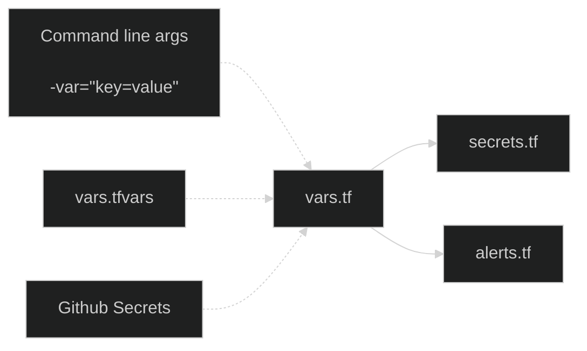

# Outline

How to set up a pipeline to transfer secret values from GitHub secrets to AWS secretsmanager securely, and with no manual intervention required.

## Requirements

There are two main parts, GitHub and Terraform:

### GitHub

- The JSON snippet containing the credentials must be stored in GitHub secrets encoded as a base64 string (storing raw JSON is strongly discouraged by GitHub, and is difficult to work with).
  - Example json file, before conversion:

```json
{
    "hostname" : "host.eu-west-2.rds.amazonaws.com",
    "port" : 5432,
    "database" : "db_name",
    "username" : "user_name",
    "password" : "password"
}
```

### Terraform

When running terraform locally, you will be required to pass in information that is not kept on the git repository.

This information can be stored in `/terraform/vars.tfvars`
Then simply call plan or apply with the `-var-file=` argument:

`terraform plan -var-file=vars.tfvars`
<sup>contact a team member for a prepared vars.tfvars file</sup>

an example structure could look like this:

```
db_credentials_olap = base64string
db_credentials_oltp = base64string
sns_emails = base64string
```

These secrets are read directly into terraform without being stored into a file, and used in secrets.tf for database credentials, and alerts.tf for emails for the SNS topic.



- AWS "parameters and secrets" ARN must be entered in the "layers" attribute for the lambda within terraform. This is a fixed ARN provided by AWS. E.g.:

```tf
resource "aws_lambda_function" "secretsmanager_test" {
  s3_bucket     = aws_s3_bucket.code_bucket.id
  s3_key        = aws_s3_object.lambda_code.key
  function_name = var.lambda_name
  role          = aws_iam_role.lambda_role.arn
  layers        = ["arn:aws:lambda:eu-west-2:133256977650:layer:AWS-Parameters-and-Secrets-Lambda-Extension:11"]
  handler       = "sm-test.lambda_handler"
  runtime       = "python3.11"
}
```

- Each set ot credentials to be stored in secretsmanager (i.e. for OLTP and OLAP) must be defined with a `aws_secretsmanager_secret` and `aws_secretsmanager_secret_version` entry. E.g.:

```tf
resource "aws_secretsmanager_secret" "db_creds_oltp" {
  name = var.db_credentials_oltp
  recovery_window_in_days = 0
}

resource "aws_secretsmanager_secret_version" "db_creds_oltp" {
  secret_id     = aws_secretsmanager_secret.db_creds_oltp.id
  secret_string = data.local_file.db_credentials_oltp.content
}
```

- Any `aws_secretsmanager_secret` must be stored with `recovery_window_in_days = 0` otherwise it will cause errors destroying and recreating.

  - - The role assigned to the lambda must include a policy for action "secretsmanager:GetSecretValue", and it must reference the arns of the credentials stored in secretsmanager, e.g.:

```tf
data "aws_iam_policy_document" "sm_document" {
  statement {
    actions = ["secretsmanager:GetSecretValue"]

    resources = [
        aws_secretsmanager_secret_version.db_creds_oltp.arn,
        aws_secretsmanager_secret_version.db_creds_olap.arn
    ]
  }
}
```

## Further research

There is a way to cache reads from secretsmanager for improved performance. Non-cached performance is not noticeably bad.
